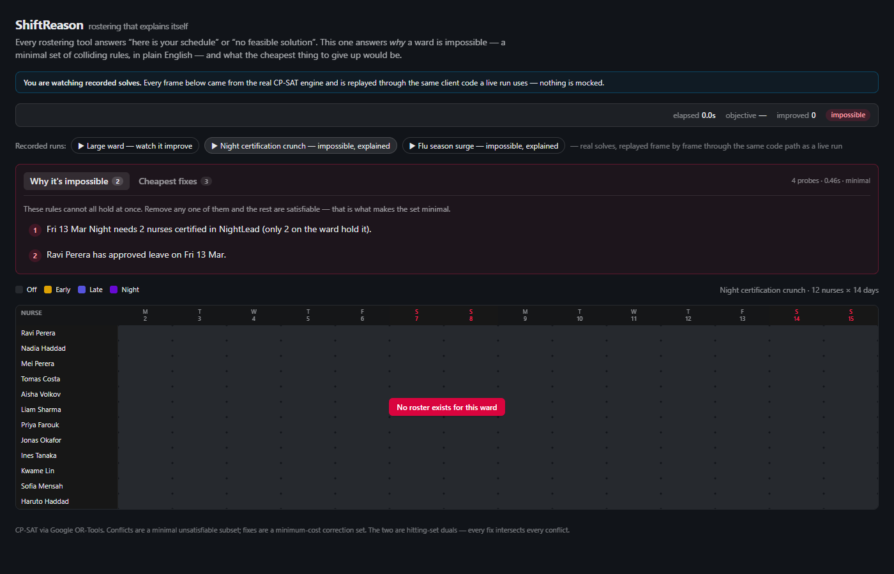
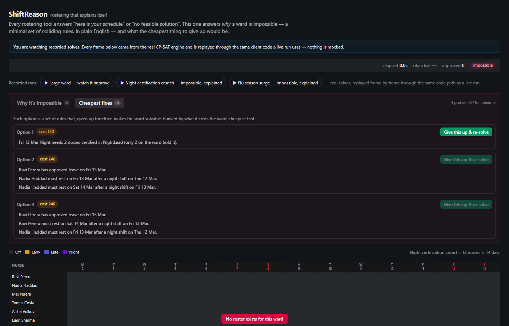
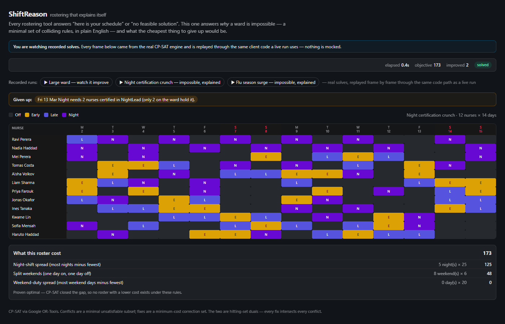
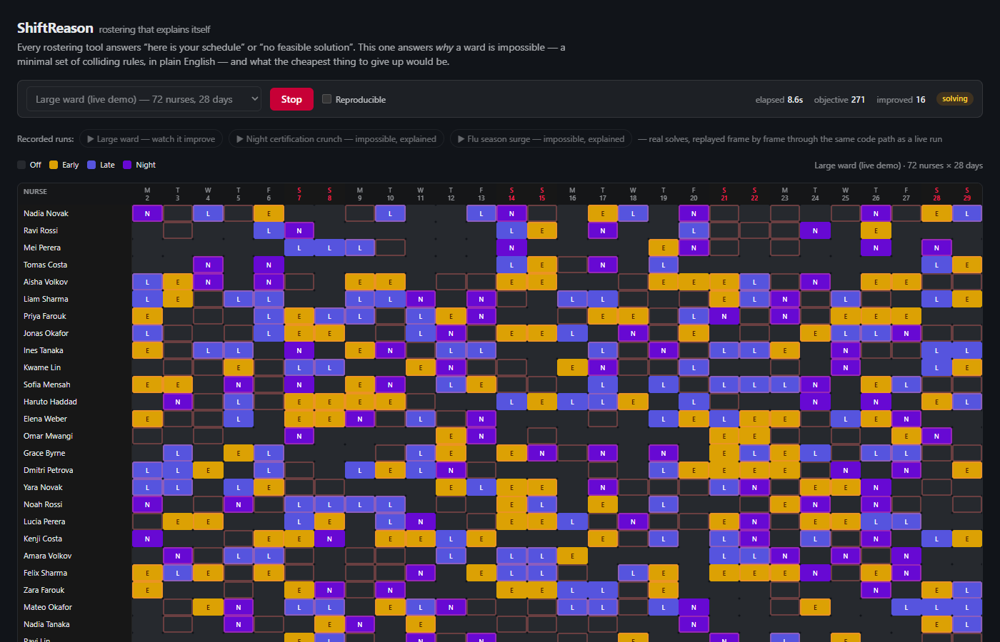
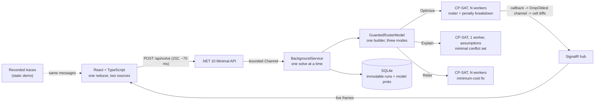

# ShiftReason

**Rostering that explains itself.** A .NET 10 staff-rostering engine built on Google's CP-SAT solver. When a roster is impossible, it tells you *why* — the smallest set of rules that collide, in plain English — and what the cheapest thing to give up would be.

[](https://github.com/pasindu9999/ShiftReason/actions/workflows/ci.yml)

**Static demo:** _add your Cloudflare Pages URL_ · **Live solver:** _add your Azure Container Apps URL_



## The problem

Anyone who builds a staff roster — a hospital ward, a café, a security firm — is solving a hard constraint problem, usually by hand in a spreadsheet. The tools that automate it share one failure: when the requirements can't all be met, they say *"no feasible solution"* and stop. With forty rules in play, the manager is left guessing which one to bend.

ShiftReason answers two questions those tools don't:

1. **Why is this impossible?** A *minimal* conflicting set: every rule in it is necessary, so removing any one makes the rest satisfiable.
2. **What's the cheapest way out?** A *minimum-cost* set of rules to relax, ranked, each with a button that re-solves with it applied.

## What it looks like

| Cheapest fixes, ranked by what they cost the ward | Fix applied: solved, and proven optimal |
|---|---|
|  |  |



*A 72-nurse, 28-day ward solving live. Improving solutions stream over SignalR, and outlined cells are the ones the latest improvement moved.*

## How it works



Every user-visible rule becomes a guarded constraint: it's only enforced when its own boolean literal is true. That single mechanism, used three ways, powers the whole product:

- **Optimize** pins every guard on and minimises the soft penalties. This produces the roster.
- **Explain** hands the guards to CP-SAT as *assumptions*. When the model is infeasible, CP-SAT reports which assumptions it needed to prove it. Those are then shrunk to a true minimal set by linear deletion.
- **Relax** frees every guard and minimises the business cost of the ones switched off: a minimum-cost correction set.

The conflict set and the fixes are **hitting-set duals**. Every fix breaks at least one rule in every conflict, and the tests assert exactly that.

## Engineering decisions worth talking about

Each of these was measured in this codebase, not assumed.

**The explanation only works in a narrow configuration, and fails silently outside it.** CP-SAT honours assumptions only with *one worker, no objective* and `interleave_search` off. Outside that, it returns *every* assumption as the "conflict", with no error status. The Explain mode is therefore a separate model configuration, and the explainer watches the solver log for the degradation warning and throws rather than print nonsense. A test asserts the core is a strict subset.

**A process abort that presolve usually hides.** The CP-SAT loader in v9.15 still contains `CHECK(!HasEnforcementLiteral(ct))` for `exactly_one` / `at_most_one`. In release builds that kills the process: no exception, no stack trace, and `Validate()` passes beforehand. I couldn't reproduce it on small models, because presolve strips always-true guards first. That makes it latent and data-dependent: the likely victim is the biggest scenario, mid-demo. So [`ModelLint`](src/ShiftReason.Solver/ModelLint.cs) rejects any such constraint on every build, and structural rules (like one shift per nurse per day) are never guarded at all.

**Structural rules versus policy rules.** Only policy rules get a guard literal. That keeps enforcement literals away from the dangerous constraint types, and it stops the cheapest-fix search from ever proposing *"give up the rule that a nurse works one shift a day"*.

**Linear deletion, not QuickXplain.** QuickXplain searches the full rule set. But CP-SAT already hands back a narrowed core, so deleting one rule at a time from *that* takes fewer, smaller solves. It found the night-crunch conflict in 4 probes and 0.46 s.

**The solution callback holds CP-SAT's global mutex.** Every microsecond spent in it blocks every solver worker. So the callback only fills a reused buffer and `TryWrite`s to a bounded, drop-oldest channel. A separate pump owns SignalR, and the callback is wrapped in a `catch`, because an exception escaping it would unwind through C++.

**Deltas, not grids.** A 72×28 grid in full is 44 KB, uncomfortably close to SignalR's 64 KB buffer. Now the baseline frame carries only worked cells (20 KB), and the median improvement after that is a 7 KB diff.

**One solver worker is a cliff, not a slope.** With a single worker, CP-SAT loses large-neighbourhood search, and the 44-nurse ward can't find even a first roster in ten seconds: eight tests fail. With two workers, all of them pass. So the app never runs fewer than two, even on a 2-core container where that means sharing a core with Kestrel. CI proves the count comes from the cgroup CPU quota, not the host.

**Determinism costs throughput, so it's a choice rather than the default.** Reproducible mode (`interleave_search`, pinned seed, deterministic time limit) gives byte-identical rosters across runs. For the same budget it reached an objective of 527, against 141 for the default parallel portfolio. Runs also store the serialised model, not just an input hash: one reordered dictionary in the builder changes the search without changing the hash.

**The static demo isn't a mock.** The published demo replays recorded solves through *the same reducer* the live SignalR client feeds, including a recorded re-solve behind the "give this up" button. The tests replay every recording and check it's internally consistent.

## Running it

**Docker** — the production image, one command:

```bash
docker compose up --build        # http://localhost:8080
```

**Development**, with the .NET 10 SDK and Node 24:

```bash
dotnet run --project src/ShiftReason.Api --urls http://localhost:5217    # API + SignalR
npm --prefix src/ShiftReason.Web install
npm --prefix src/ShiftReason.Web run dev                                  # http://localhost:5173, proxied to the API
```

**Tests:**

```bash
dotnet test ShiftReason.slnx               # solver + API integration (real CP-SAT solves, real SignalR)
npm --prefix src/ShiftReason.Web test      # replays every demo recording through the reducer
bash deploy/smoke-test.sh http://localhost:8080 # end to end against a running container
```

## Deploying

[`docs/DEPLOYMENT.md`](docs/DEPLOYMENT.md) walks through it end to end. The static demo goes on Cloudflare Pages; the live solver goes on Azure Container Apps, provisioned with [Bicep](deploy/azure/main.bicep), deployed from GitHub Actions over OIDC (no stored credentials), and smoke-tested after every rollout. Both run free: the container scales to zero, runs at most one replica, and a budget alert fires if anything ever costs money.

## Layout

```text
src/ShiftReason.Domain     rules, presets, and an independent roster validator (no OR-Tools reference)
src/ShiftReason.Solver     CP-SAT model builder, explainer, relaxation advisor, streaming callback
src/ShiftReason.Api        Minimal API, SignalR hub, background worker, SQLite run store
src/ShiftReason.Web        React + TypeScript + Tailwind client, and the demo recordings
tests/                     xUnit: solver behaviour, and the API pipeline end to end
deploy/                    smoke test, Bicep template, provisioning and OIDC scripts
scripts/record-demos.mjs   re-records the static demo from a running API
spike/                     Phase 0 experiments that retired the platform risks first
```

## Built with

.NET 10 · ASP.NET Core Minimal APIs · SignalR · EF Core + SQLite · [Google OR-Tools](https://developers.google.com/optimization) CP-SAT 9.15 (Apache 2.0) · React 19 · TypeScript · Vite · Tailwind CSS · xUnit · Vitest · Docker · GitHub Actions · Azure Container Apps · Bicep · Cloudflare Pages
